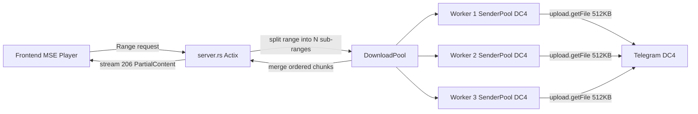

## Architecture: Multi-Connection Download Pool

### Problem
Single TCP connection caps at ~5.7MB/s due to Telegram's per-connection rate limit + grammers' 1-connection-per-DC design.

### Solution: `DownloadPool` -- N parallel SenderPool instances for file transfers

### Implementation Steps

1. **`download_pool.rs` (new file)** -- `DownloadPool` manages N `SenderPool` instances:
   - `DownloadPool::new(session_path, api_id, num_workers)` -- creates N session copies + N SenderPools
   - `DownloadPool::parallel_download(media, start_byte, end_byte)` -- splits range into N sub-ranges, dispatches across workers via `tokio::join!`, merges results in order
   - `DownloadPool::sequential_download(media, start_byte, end_byte)` -- single-worker fallback for small ranges
   - Worker count: 3 (3x bandwidth = ~17MB/s theoretical max)

2. **`auth.rs`** -- Initialize DownloadPool alongside main client:
   - Main SenderPool handles API calls (auth, messages, updates) 
   - DownloadPool handles only `upload.getFile` calls
   - This follows Telegram's recommendation: "separate connections for file transfers"

3. **`server.rs`** -- Use DownloadPool for streaming:
   - Range requests >1MB: use `parallel_download` across N workers
   - Range requests ≤1MB: use single worker (avoid overhead of splitting small ranges)
   - Stream merged chunks to frontend as 206 PartialContent

4. **`fs.rs`** -- Use DownloadPool for file downloads:
   - Fresh downloads: parallel across N workers
   - Gap-filling from cache: parallel for large gaps, sequential for small gaps

5. **`lib.rs`** -- Add `DownloadPool` to `TelegramState`, change semaphore:
   - `download_semaphore` → `Semaphore::new(3)` (allow concurrent streaming + background cache + file download)
   - Or: separate semaphores for streaming vs background-cache vs file-download

6. **Session management**:
   - Copy `telegram.session` to `telegram-download-worker-{0,1,2}.session` on pool init
   - Each worker's session file contains the same auth key + DC info
   - Workers are created on-demand (lazy connection to media DC)

### Expected Impact
| Metric | Current | After (3 workers) |
|--------|---------|-------------------|
| Streaming bandwidth | ~5.7MB/s | ~15-17MB/s |
| File download speed | ~5.7MB/s | ~15-17MB/s |
| First-frame latency | Same | Same (still 512KB first chunk) |

### TOS Compliance
Telegram's official optimization guide explicitly recommends multi-connection downloads. No TOS violation.

### Risks
- **FLOOD_WAIT**: Mitigated by limiting to 3 workers + rate-aware dispatch
- **Session conflicts**: Each worker has its own session file copy
- **Worker startup cost**: ~1-2s per worker for DC connection + auth key exchange (only on first use)