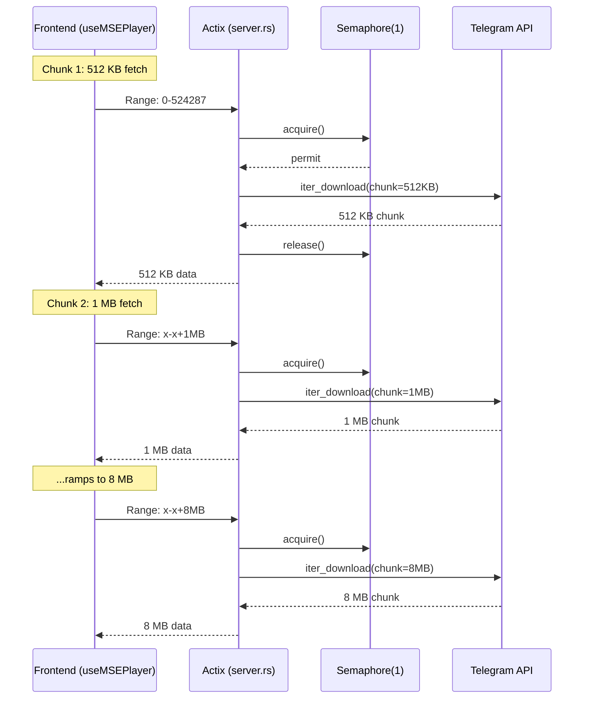

## Spec: Progressive Chunk Sizing for Bandwidth Saturation

### Problem
Video streaming and download from the player don't fully utilize available bandwidth because all Telegram API calls use a fixed **512 KB chunk size**. Throughput is capped at `512 KB / Telegram_RTT` (~2.5-5 MB/s regardless of connection speed).

### Solution
Progressive chunk sizing: **512 KB → 1 MB → 2 MB → 4 MB → 8 MB**. Start small so the first video frame appears quickly, then ramp up to saturate bandwidth.

### Data Flow



### Ramp Schedule (all paths)

| Chunks since start | Chunk Size |
|-------------------|-----------|
| 0–2               | 512 KB    |
| 3–5               | 1 MB      |
| 6–8               | 2 MB      |
| 9–11              | 4 MB      |
| 12+               | 8 MB      |

---

### File 1: `server.rs` — Streaming endpoint

**How progression works**: The frontend already sends progressively larger `Range` headers. The backend mirrors the request size as the Telegram chunk size — no counter needed.

**Changes**:
- Replace `DOWNLOAD_CHUNK_SIZE: i32 = 512 * 1024` with `MIN_CHUNK_SIZE: i32 = 512 * 1024` and `MAX_CHUNK_SIZE: i32 = 8 * 1024 * 1024`
- Compute `telegram_chunk_size = content_length.clamp(MIN_CHUNK_SIZE, MAX_CHUNK_SIZE)` 
- Use `telegram_chunk_size` for BOTH the `chunks_to_skip`/`bytes_to_discard` calculations AND `iter_download().chunk_size()`
- Affected lines: ~40 (constant), ~330-336 (chunk logic)

---

### File 2: `useMSEPlayer.ts` — Frontend MSE player

**Change**: Add `8 * 1024 * 1024` to the `FRAGMENT_SIZES` array.

```typescript
const FRAGMENT_SIZES = [
  512 * 1024,      // 512 KB
  1024 * 1024,     // 1 MB
  2 * 1024 * 1024, // 2 MB
  4 * 1024 * 1024, // 4 MB
  8 * 1024 * 1024, // 8 MB  ← NEW
];
```

No other changes needed — `getChunkSize()` uses the array length, and moov-discovery code uses `FRAGMENT_SIZES[0]` (unchanged).

---

### File 3: `fs.rs` — Direct file download

Two paths to fix:

**Path A — Gap-filling** (line ~454): Each gap creates a new iterator. Track a `chunks_downloaded` counter across all gaps, use it to drive `progressive_chunk_size()`.

- Add helper: `fn progressive_chunk_size(chunks: u32) -> i32` implementing the ramp table
- In gap loop: `let cs = progressive_chunk_size(total_chunks);` → use for `chunk_size` and `skip_chunks`/`skip_bytes` calcs
- Increment `total_chunks` after each chunk

**Path B — Fresh download** (line ~578): Currently `client.iter_download(&media)` with no `.chunk_size()`. Since the iterator is long-lived, we recreate it when the chunk size bumps.

- Track `total_chunks` and `current_chunk_size`
- After each chunk: check if `progressive_chunk_size(total_chunks + 1) != current_chunk_size`
- If bump needed: create new iterator with `.chunk_size(new_cs).skip_chunks(downloaded / new_cs)`, discard leading bytes from first chunk to align with `downloaded`

---

### File 4: `streaming.rs` — Background cache

Same pattern as fs.rs gap-filling. Replace `let chunk_size: i32 = 512 * 1024` with the progressive function, tracking chunks across gaps.

- Add `let mut total_chunks: u32 = 0`
- In gap loop: `let cs = progressive_chunk_size(total_chunks);` → use for `chunk_size` and `skip_chunks`/`skip_bytes`
- Increment after each chunk

---

### What stays unchanged
- `download_semaphore: Semaphore(1)` — no change (fewer API calls with larger chunks = lower FLOOD_WAIT risk)
- `prebuffer_speed_limit_kb` and `download_speed_limit_kb` throttle logic — unchanged (user-set limits still apply after chunk delivery)
- HLS module — unaffected

### Risk Assessment
- **FLOOD_WAIT**: Decreased (fewer requests/sec)
- **Memory**: 8 MB max per chunk, fine for desktop
- **Concurrent starvation**: Progressive ramp (512 KB → 1 MB for first 6 chunks) ensures the stream gets frequent semaphore access early, building buffer before download dominates at 8 MB
- **Seek waste**: Up to ~4 MB wasted on average per seek (vs ~256 KB before), acceptable trade-off