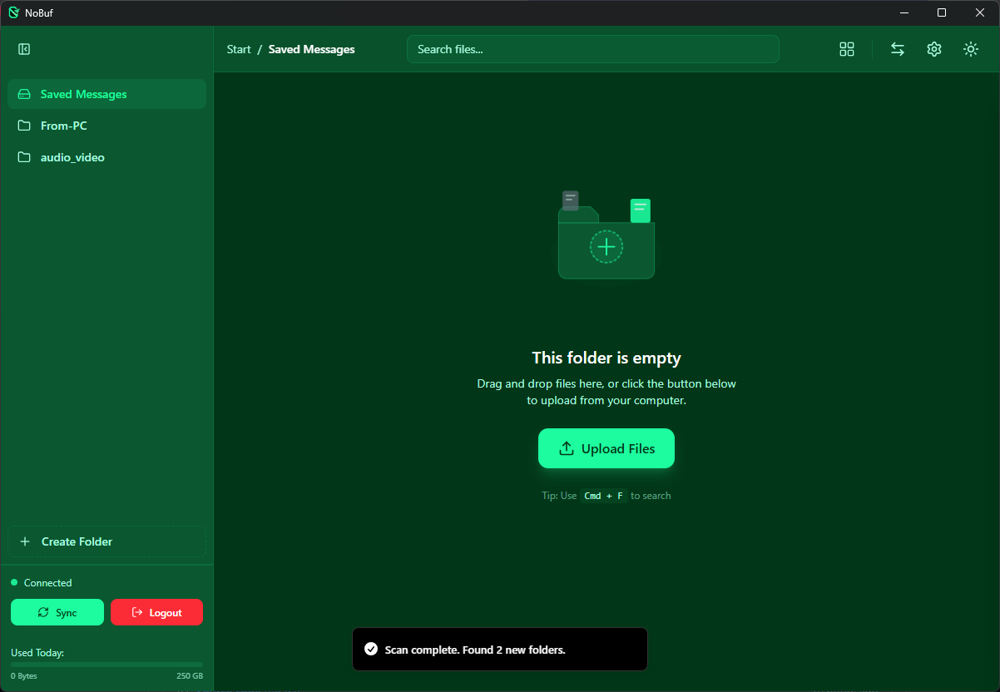
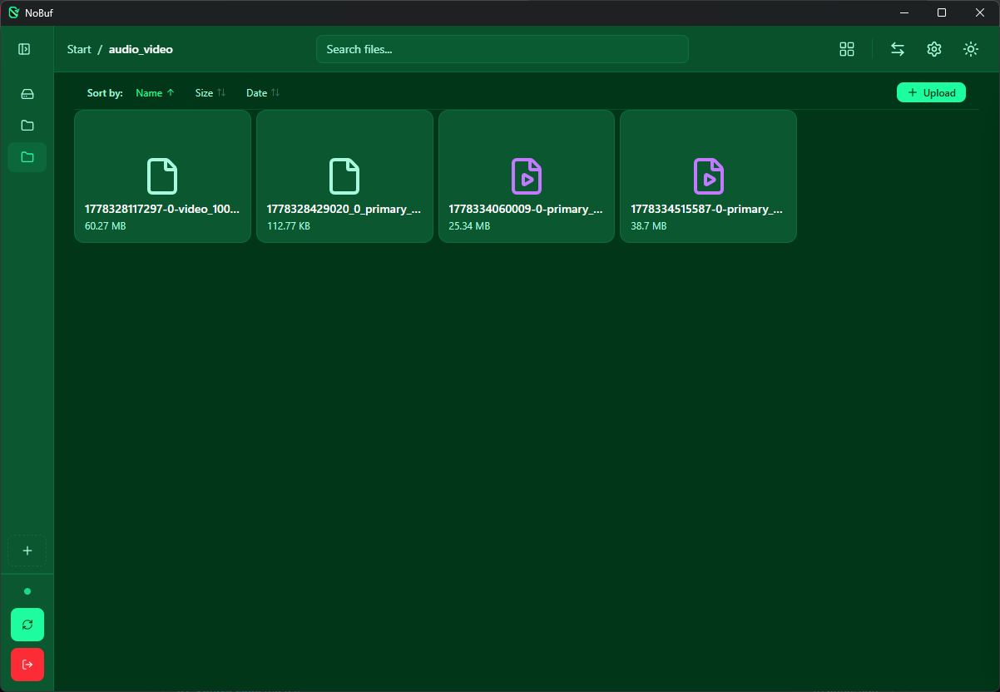
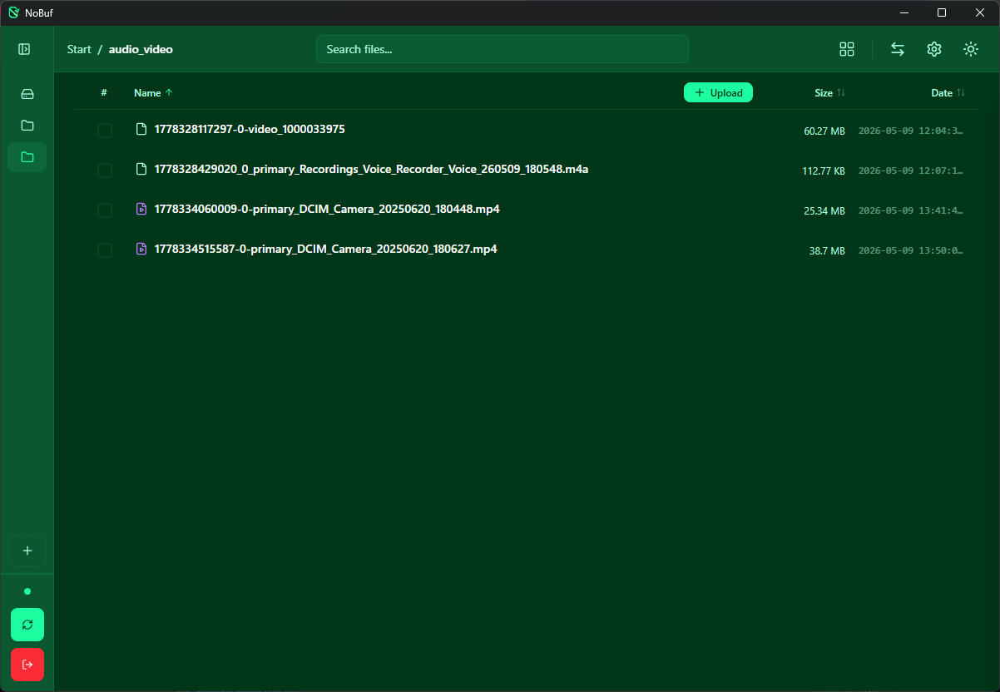
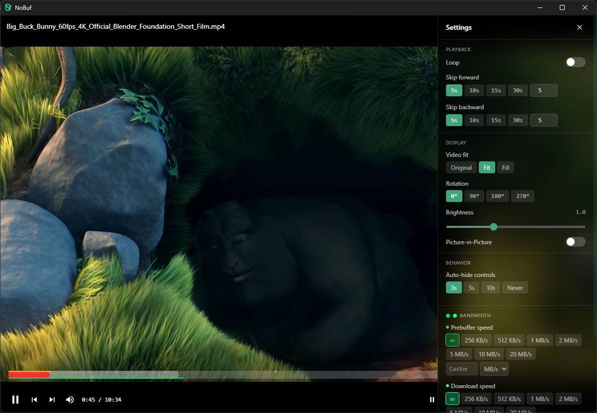
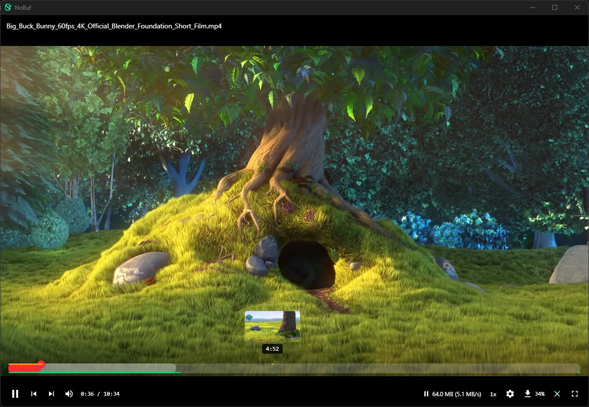
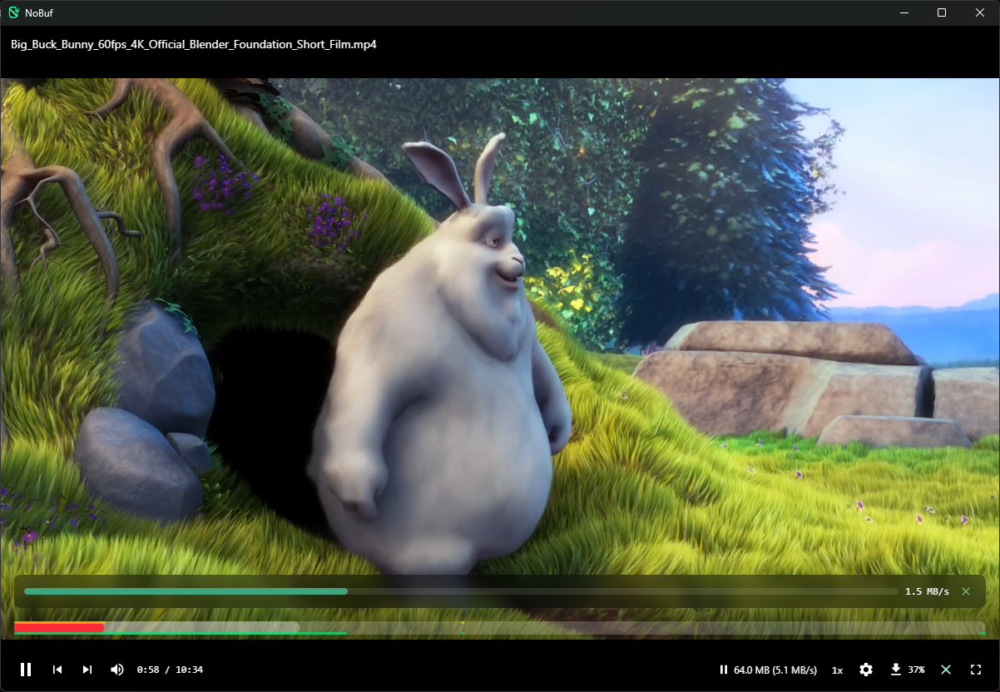
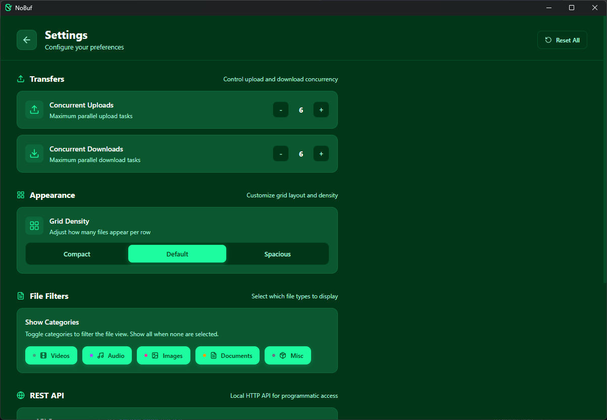
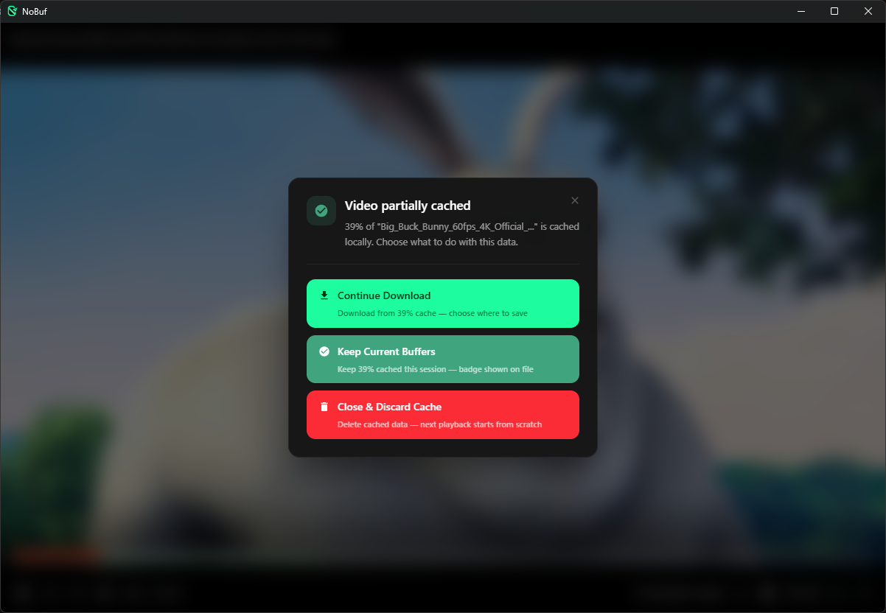
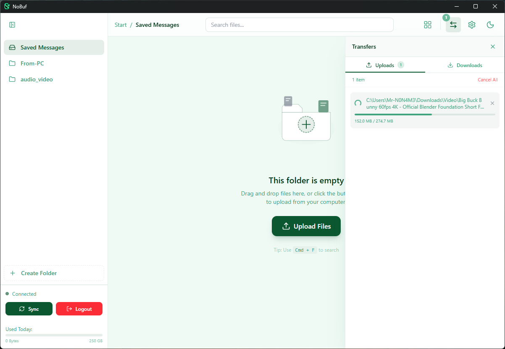
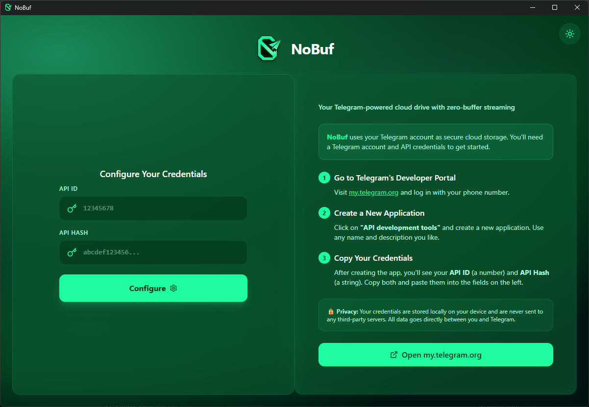

<p align="center">
  
</p>

<h3 align="center">Zero-buffer video streaming. Powered by Telegram.</h3>

<p align="center">
  An open-source desktop player that streams video from Telegram channels<br/>
  with continuous prebuffering — so playback never stalls, even on seeks.
</p>

<p align="center">
  <a href="https://github.com/Istiaq-Edu/BlackBox/releases"></a>
  <a href="https://github.com/Istiaq-Edu/BlackBox/blob/main/LICENSE"></a>
  
  <a href="https://github.com/Istiaq-Edu/BlackBox/actions"></a>
  
  
</p>

---

> ### 🚀 Free AI Cloud — $150 Bonus
> **[Sign up at AgentRouter.org](https://agentrouter.org/register?aff=rBMj)** and get **$150 free balance** to run AI agents, LLMs, and inference workloads in the cloud.
>
> ⚠️ **Use an older GitHub account** when signing up to qualify for the $150 bonus.
> 🎁 Signing up through **[this referral link](https://agentrouter.org/register?aff=rBMj)** grants you an **extra $25** on top of the base bonus.

---

> ### 📂 Already Have a Telegram Channel?
> Just append **`[NB]`** to the channel name — BlackBox detects it automatically. No re-upload, no migration needed.
>
> *Example:* `My Media` → rename to `My Media [NB]` → it appears in BlackBox instantly.

---

## Why "BlackBox"?

Because buffering is a solved problem — we just solved it differently.

BlackBox uses **Media Source Extensions** (MSE) to stream video directly from Telegram's servers into your browser engine. There's no download-first, no transcode-wait, no spinner. The player continuously prebuffers the next 60 seconds while you watch, so playback never stalls.

Telegram channels become your video library. Telegram's CDN becomes your streaming backend. **BlackBox is the player that makes it feel local.**

---

## How It Works

```
You click play
       │
       ▼
  ┌─────────────────────────────────────────────────────────────────┐
  │  512 KB fetched from Telegram (first frame in ~200ms)           │
  │       │                                                         │
  │       ▼                                                         │
  │  mp4box.js demuxes MP4 → video + audio init segments            │
  │       │                                                         │
  │       ▼                                                         │
  │  MediaSource SourceBuffers receive fragments                     │
  │       │                                                         │
  │       ▼                                                         │
  │  ▶️  Playback starts immediately                                 │
  └─────────────────────────────────────────────────────────────────┘
       │
       │  Meanwhile, in the background:
       ▼
  ┌─────────────────────────────────────────────────────────────────┐
  │  Progressive prebuffer (next 60 seconds):                       │
  │                                                                 │
  │  512KB → 1MB → 2MB → 4MB → 8MB   (fragment sizes ramp up)      │
  │                                                                 │
  │  Downloaded bytes → disk cache (.dat + .meta)                   │
  │  Cache tracks exact byte ranges — knows what's cached            │
  │  3 parallel TCP connections saturate your bandwidth              │
  │  Overlapping range requests are deduplicated                     │
  └─────────────────────────────────────────────────────────────────┘
       │
       │  You seek to a new position:
       ▼
  ┌─────────────────────────────────────────────────────────────────┐
  │  500ms debounce (prevents wasteful downloads on rapid seeks)    │
  │  Cache checked first → instant playback if already buffered      │
  │  Otherwise → fresh 512KB fetch → immediate playback              │
  │  Old buffer evicted, new prebuffer starts from seek point        │
  └─────────────────────────────────────────────────────────────────┘
       │
       │  You close the player:
       ▼
  ┌─────────────────────────────────────────────────────────────────┐
  │  Background cache continues downloading the full video           │
  │  Gap detection finds what's missing, fills it in parallel        │
  │  Next time you open this video → instant playback from cache     │
  └─────────────────────────────────────────────────────────────────┘
```

---

## The Tech Behind Zero-Buffer

| What | How | Why |
|------|-----|-----|
| **Progressive fragments** | 512KB → 8MB sizes after seek | First frame in ~200ms, then saturate bandwidth |
| **60s prebuffer window** | Continuously fetches ahead of playback | You never outrun the buffer |
| **Disk-backed stream cache** | `.dat` data + `.meta` byte-range sidecar | Instant replay, survives app restarts |
| **Download coordinator** | Deduplicates overlapping range requests | No wasted bandwidth on concurrent seeks |
| **3× parallel TCP pool** | Split file across 3 connections to Telegram DC | ~3× bandwidth vs single-threaded |
| **Background cache** | Continues after player close | Next play is instant from cache |
| **Seek debounce** | 500ms delay for rapid seeks | Arrow-key spam doesn't spawn 15 overlapping downloads |
| **VBR byte→time table** | Built from mp4box calibration points | Accurate seek-to-byte for variable bitrate content |
| **50MB buffer cap + 2min backpressure** | Stops downloading when ahead enough | Prevents memory bloat on long videos |

> [!IMPORTANT]
> **Format Support:** The MSE prebuffer pipeline currently supports **`.mp4`** files only. Support for **`.ts`** (MPEG-TS) and **`.mkv`** containers is planned for a future release. Non-MP4 video files fall back to direct download playback.

---

## Why Telegram?

| What you get | How it works |
|---|---|
| **Unlimited storage** | Telegram stores files permanently — no quotas, no expiry |
| **Global CDN** | Streams from the nearest data center worldwide |
| **2 GB per file** | That's a full 4K movie or an entire TV season |
| **Zero cost** | Free for all users, no subscription needed |
| **Instant availability** | No processing delays — upload, stream, or download immediately |

Your Telegram channels become a video library. Your Saved Messages become a quick-access drive. BlackBox gives you the explorer UI and streaming engine to make it seamless.

---

## Full Feature Set

**Streaming**

- 🎬 **MSE Video Player** — Media Source Extensions with mp4box.js demuxing. Progressive fragment sizing for instant first frame.
- 🔄 **Continuous Prebuffer** — 60-second look-ahead. Downloads while you watch.
- 💾 **Disk-Backed Cache** — Byte-range tracking with gap detection. Cached videos replay instantly.
- 🔁 **Background Cache** — Close the player, download continues. Come back later, instant playback.
- 🎞️ **Scrub Previews** — Sprite sheet generation for frame-accurate seeking.
- 🎵 **Audio Playback** — Built-in player with speed control.

**File Management**

- 📁 **Folder System** — Telegram channels as folders. Create, rename, delete, drag-and-drop.
- 📂 **File Explorer** — Grid and list views with virtual scrolling for thousands of files.
- 📤 **Drag & Drop Upload** — Upload queue with progress, speed tracking, and cancellation.
- 📥 **Parallel Downloads** — 3 concurrent TCP connections per file. ~3× faster than single-threaded.
- 🖼️ **Image Preview** — Inline thumbnails and full-resolution viewer.
- 📄 **PDF Viewer** — Infinite-scroll rendering with zoom and page navigation.

**Platform**

- 🤖 **REST API** — Local HTTP API (off by default) with API key auth. Enables AI agents and automation.
- 📊 **Bandwidth Monitor** — Daily upload/download tracking with configurable limits.
- 🎚️ **Speed Limiter** — Per-session throttle for streaming and downloads.
- 🔄 **Auto-Updates** — built-in update delivery via Tauri's updater plugin.
  > [!CAUTION]
  > **Auto-update is not yet active.** Watch [Releases](https://github.com/Istiaq-Edu/BlackBox/releases) for new builds.
- 🔒 **Local-Only** — All credentials and data stay on your machine. No telemetry, no third-party servers.
- 🖥️ **Cross-Platform** — Windows, macOS (Intel + Apple Silicon), Linux (AppImage + .deb).
- 🚪 **Exit Options** — Choose what happens on close: minimize to tray, quit, or cancel.
- 🎛️ **Video Player Settings** — Playback speed, video fit mode, brightness, rotation, and loop control.

---

## Screenshots

| Main Dashboard | Grid View |
|:--------------:|:---------:|
|  |  |

| List View | Video Player Settings |
|:---------:|:---------------------:|
|  |  |

| Preview Thumbnails | Cache Playback |
|:------------------:|:--------------:|
|  |  |

| Settings | Exit Options |
|:--------:|:------------:|
|  |  |

| Download / Upload | Authentication |
|:-----------------:|:--------------:|
|  |  |

---

## Architecture

```
┌─────────────────────────────────────────────────────────────────┐
│                        Tauri v2 Desktop Shell                    │
│                                                                  │
│  ┌─────────────────────────────────────────────────────────────┐ │
│  │  React + TypeScript + Tailwind                               │ │
│  │                                                              │ │
│  │  ┌─────────────┐  ┌──────────────────┐  ┌───────────────┐  │ │
│  │  │ FastStream   │  │ File Explorer    │  │ Settings &    │  │ │
│  │  │ MSE Player   │  │ (Grid/List)      │  │ API Config    │  │ │
│  │  │              │  │                  │  │               │  │ │
│  │  │ mp4box demux │  │ Drag & Drop      │  │ Speed Limits  │  │ │
│  │  │ SourceBuffer │  │ Virtual Scroll   │  │ Bandwidth     │  │ │
│  │  │ Prebuffer    │  │ Thumbnails       │  │ REST API key  │  │ │
│  │  └──────┬───────┘  └────────┬─────────┘  └───────┬───────┘  │ │
│  └─────────┼──────────────────┼─────────────────────┼──────────┘ │
│            │           Tauri IPC Commands            │            │
│  ┌─────────┴──────────────────┴─────────────────────┴──────────┐ │
│  │                    Rust Backend (Grammers)                    │ │
│  │                                                              │ │
│  │  ┌──────────────┐ ┌───────────────┐ ┌────────────────────┐  │ │
│  │  │ Auth         │ │ File System   │ │ Download Pool       │  │ │
│  │  │ (phone/qr/   │ │ (CRUD/Move/   │ │ (3 parallel TCP     │  │ │
│  │  │  2FA)        │ │  Upload)      │ │  connections)       │  │ │
│  │  └──────────────┘ └───────────────┘ └────────────────────┘  │ │
│  │  ┌──────────────┐ ┌───────────────┐ ┌────────────────────┐  │ │
│  │  │ Stream Cache │ │ Coordinator   │ │ Speed Limiter       │  │ │
│  │  │ (.dat + .meta│ │ (dedup range  │ │ (prebuffer +        │  │ │
│  │  │  byte ranges)│ │  requests)    │ │  download)          │  │ │
│  │  └──────────────┘ └───────────────┘ └────────────────────┘  │ │
│  └──────────────────────────────────────────────────────────────┘ │
│                                                                  │
│  ┌─────────────────────────┐  ┌────────────────────────────────┐ │
│  │  Streaming Server        │  │  REST API Server                │ │
│  │  Actix-web :14201        │  │  Actix-web :configurable        │ │
│  │                          │  │                                  │ │
│  │  GET /stream/{id}/{msg}  │  │  GET /api/v1/files              │ │
│  │  Range requests          │  │  GET /api/v1/files/{id}         │ │
│  │  Cache-first serving     │  │  GET /api/v1/files/{id}/download│ │
│  │  HLS manifest gen        │  │  X-API-Key auth                 │ │
│  └────────────┬─────────────┘  └────────────────────────────────┘ │
└───────────────┼──────────────────────────────────────────────────┘
                │
                ▼
       ┌──────────────────┐
       │  Telegram Cloud  │
       │  (MTProto API)   │
       │                  │
       │  Channels        │──→ Video Library
       │  Saved Messages  │──→ Quick Access
       └──────────────────┘
```

---

## Tech Stack

| Layer | Technology |
|-------|-----------|
| **Frontend** | React 19, TypeScript, TailwindCSS 4, Framer Motion |
| **Video Engine** | mp4box.js (demux), MediaSource Extensions (playback) |
| **Backend** | Rust, Grammers (Telegram MTProto), Actix-web 4 |
| **Streaming** | Byte-range HTTP, stream cache, HLS manifest generation |
| **Media** | ffmpeg-sidecar, pdfjs-dist |
| **Build** | Tauri v2, Vite 7, Cargo |
| **Testing** | Vitest, Testing Library |
| **CI/CD** | GitHub Actions (Win / Linux / macOS-Intel / macOS-ARM) |

---

## Quick Start

### Prerequisites

- **Node.js v18+** — [nodejs.org](https://nodejs.org)
- **Rust (latest stable)** — install via [rustup.rs](https://rustup.rs)
- **Telegram API credentials** — obtain from [my.telegram.org](https://my.telegram.org) → API development tools

<details>
<summary><strong>Windows</strong></summary>

- Install [Visual Studio Build Tools](https://visualstudio.microsoft.com/visual-cpp-build-tools/) — select **"Desktop development with C++"**
- Windows 10/11 includes WebView2. If not, download from [Microsoft](https://developer.microsoft.com/en-us/microsoft-edge/webview2/#download-section).

</details>

<details>
<summary><strong>macOS</strong></summary>

```bash
xcode-select --install
```

</details>

<details>
<summary><strong>Linux (Ubuntu/Debian)</strong></summary>

```bash
sudo apt update && sudo apt install libwebkit2gtk-4.1-dev build-essential curl wget file \
  libxdo-dev libssl-dev libayatana-appindicator3-dev librsvg2-dev
```

</details>

### Install & Run

```bash
# 1. Clone
git clone https://github.com/Istiaq-Edu/BlackBox.git
cd BlackBox

# 2. Install frontend dependencies
cd app
npm install

# 3. Run in development mode
npm run tauri dev

# 4. Build for production
npm run tauri build
```

> **First build takes 5–15 minutes** — Rust compiles 300+ crates on initial build. Subsequent builds are fast.

---

## REST API

BlackBox includes a local REST API for programmatic access and AI integration. **Disabled by default** — enable in Settings.

### Endpoints

| Method | Path | Description |
|--------|------|-------------|
| `GET` | `/api/v1/health` | Health check + version |
| `GET` | `/api/v1/files` | List files (paginated, filterable by folder/search) |
| `GET` | `/api/v1/files/{id}` | Get file metadata |
| `GET` | `/api/v1/files/{id}/download` | Download file (supports Range headers) |
| `HEAD` | `/api/v1/files/{id}/download` | File metadata + content-length discovery |

### Authentication

All endpoints require the `X-API-Key` header. Generate a key in Settings → API. Keys are SHA-256 hashed locally — the raw key is only shown once.

```
curl -H "X-API-Key: YOUR_KEY" http://localhost:PORT/api/v1/files?limit=10
```

---

## Acknowledgments

- **[Telegram-Drive](https://github.com/caamer20/Telegram-Drive)** — BlackBox's core architecture is based on caamer20's Telegram-Drive project. The idea of using Telegram channels as a file storage backend and the initial Tauri + Grammers integration originate from this work.
- **[FastStream](https://github.com/Andrews54757/FastStream)** — the MSE video prebuffering engine and progressive fragment strategy were adapted from Andrews54757's FastStream project. The `lib/faststream/` module is based on their approach to Media Source Extensions streaming.

---

## License

MIT License. See [LICENSE](LICENSE) for details.

---

<p align="center">
  <sub>This application is not affiliated with Telegram FZ-LLC. Use responsibly and in accordance with Telegram's Terms of Service.</sub>
</p>
